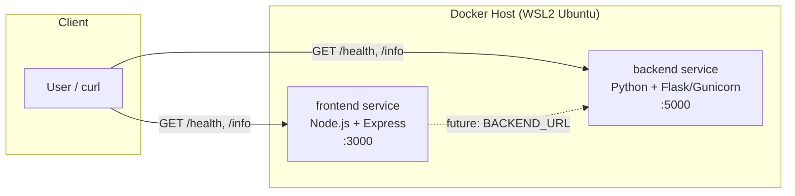

# Dummy Microservices Platform

A minimal two-service demo (`frontend` + `backend`) with `/health` and `/info`
endpoints, built as small non-root, multi-stage Docker images.

## Architecture



- **frontend** — Node.js 18 (Alpine) + Express
- **backend** — Python 3.12 (slim) + Flask/Gunicorn
- Both images run as a dedicated non-root user

## Build & Run

```bash
docker build -t frontend-service:1.0.0 ./frontend
docker build -t backend-service:1.0.0 ./backend
docker run -d --name frontend -p 3000:3000 frontend-service:1.0.0
docker run -d --name backend  -p 5000:5000 backend-service:1.0.0
curl http://localhost:3000/health
curl http://localhost:5000/health
```

---

## Week 2: Local Kubernetes Cluster via Terraform (kind)

### What was added
- `terraform/` — Terraform configuration provisioning a local Kubernetes cluster using the [`tehcyx/kind`](https://registry.terraform.io/providers/tehcyx/kind/latest) provider (kind = Kubernetes IN Docker).
- `scripts/cluster.sh` — convenience script to bring the cluster up, down, or recreate it.

### New Prerequisites
| Tool | Purpose | Check |
|---|---|---|
| kind | Run local Kubernetes nodes as Docker containers | `kind version` |
| Terraform provider `tehcyx/kind` | Manage kind clusters declaratively | installed automatically via `terraform init` |

Install kind:
```bash
curl -Lo ./kind https://kind.sigs.k8s.io/dl/v0.23.0/kind-linux-amd64
chmod +x ./kind && sudo mv ./kind /usr/local/bin/kind
```

### Terraform Variables (`terraform/variables.tf`)
| Variable | Description | Default |
|---|---|---|
| `cluster_name` | Name of the kind cluster | `microservices-cluster` |
| `kubernetes_version` | kind node image / Kubernetes version | `v1.29.2` |
| `worker_node_count` | Number of worker nodes | `1` |
| `kubeconfig_path` | Where the kubeconfig is written | `~/.kube/config-microservices-cluster` |
| `ingress_host_port` | Host port mapped to node port 80 | `8080` |

Override any variable at apply time, e.g.:
```bash
terraform -chdir=terraform apply -var="worker_node_count=2" -auto-approve
```

### Setup Instructions
```bash
cd terraform
terraform init
terraform plan
terraform apply -auto-approve

export KUBECONFIG=~/.kube/config-microservices-cluster
kubectl cluster-info
kubectl get nodes -o wide
```

### Cluster Lifecycle Script
```bash
./scripts/cluster.sh up         # provision (terraform apply)
./scripts/cluster.sh status     # show cluster + node status
./scripts/cluster.sh recreate   # destroy then re-apply, for testing
./scripts/cluster.sh down       # destroy (terraform destroy)
```

### Verification Checklist
- [x] `terraform apply` completes with no errors
- [x] `kubectl cluster-info` shows the control plane running
- [x] `kubectl get nodes` shows control-plane + worker node(s) as `Ready`
- [x] `kind-microservices-cluster` context available via `kubectl config get-contexts`

---

## Week 3: Kubernetes Manifests, Internal Service Communication, Probes & Resource Limits

### What was added
- `k8s/` — raw Kubernetes YAML manifests (no Helm yet) for both microservices:
  - `00-namespace.yaml` — dedicated `microservices-demo` namespace
  - `01-configmap.yaml` — shared non-sensitive config (app version, backend URL, etc.)
  - `02-secret.yaml` — dummy Opaque secret (API key, DB password placeholders)
  - `03/05-*-deployment.yaml` — Deployments for backend/frontend with resource requests/limits and liveness/readiness probes
  - `04/06-*-service.yaml` — ClusterIP Services enabling internal DNS-based discovery

### New Prerequisites
None beyond Week 1/2 (`kubectl`, a running kind cluster from Week 2).

### Setup Instructions
```bash
# Load locally built images into the kind cluster (kind can't see the Docker Desktop cache directly)
kind load docker-image frontend-service:1.0.0 --name microservices-cluster
kind load docker-image backend-service:1.0.0 --name microservices-cluster

# Apply manifests
kubectl apply -f k8s/

# Verify
kubectl get all -n microservices-demo
```

### Verifying Internal Communication
```bash
FRONTEND_POD=$(kubectl get pods -n microservices-demo -l app=frontend -o jsonpath='{.items[0].metadata.name}')
kubectl exec -n microservices-demo "$FRONTEND_POD" -- curl -s http://backend:5000/health
```
Services communicate over the cluster's internal DNS (`<service-name>.<namespace>.svc.cluster.local`, or just `<service-name>` within the same namespace) — no NodePort or external exposure needed for pod-to-pod traffic.

### Resource Limits & Requests
| Service | CPU Request | CPU Limit | Memory Request | Memory Limit |
|---|---|---|---|---|
| frontend | 50m | 200m | 64Mi | 128Mi |
| backend | 100m | 300m | 128Mi | 256Mi |

### Probes
Both services expose `/health` for readiness (checked every 10s, 5s initial delay) and liveness (checked every 20s, 15s initial delay), so Kubernetes only routes traffic to ready pods and restarts unresponsive ones automatically.

### Note: curl added to runtime images
The base Dockerfiles from Week 1 didn't include `curl`, so `kubectl exec ... -- curl` failed with
`executable file not found in $PATH`. Both Dockerfiles were updated to install `curl` in the final
runtime stage (`apk add --no-cache curl` for the Alpine-based frontend, `apt-get install curl` for
the Debian-slim backend), images were rebuilt, reloaded into kind with `kind load docker-image`,
and Deployments were force-refreshed with `kubectl rollout restart` since the image tag itself
didn't change.

### Verification Checklist
- [x] `kubectl apply -f k8s/` completes with no errors
- [x] Both Deployments show `2/2` ready replicas
- [x] `kubectl exec` + `curl` confirms frontend and backend reachability over internal DNS
- [x] `kubectl describe pod` shows configured resource requests/limits and probe results

---

## Week 4: Helm Chart

### What was added
- `helm/microservices/` — a Helm chart replacing the raw `k8s/` manifests from Week 3:
  - `Chart.yaml` — chart metadata
  - `values.yaml` — all environment-specific configuration (image tags, replica counts, resource limits, probe timings, config/secret values)
  - `templates/` — parameterized Deployment, Service, ConfigMap, and Secret templates for both services, plus `_helpers.tpl` for shared labels
- `scripts/helm-upgrade.sh` — lints the chart, then runs `helm upgrade --install`, waits for rollout, and prints release history

### New Prerequisites
| Tool | Purpose | Check |
|---|---|---|
| Helm 3 | Package and deploy the Kubernetes chart | `helm version` |

Install:
```bash
curl https://raw.githubusercontent.com/helm/helm/main/scripts/get-helm-3 | bash
```

### Chart Structure

helm/microservices/
├── Chart.yaml
├── values.yaml
└── templates/
├── _helpers.tpl
├── configmap.yaml
├── secret.yaml
├── backend-deployment.yaml
├── backend-service.yaml
├── frontend-deployment.yaml
└── frontend-service.yaml


### Key values.yaml Variables
| Variable | Description | Default |
|---|---|---|
| `frontend.image.tag` / `backend.image.tag` | Image version to deploy | `1.0.0` |
| `frontend.replicaCount` / `backend.replicaCount` | Pod replica count | `2` |
| `frontend.service.port` / `backend.service.port` | Service + container port | `3000` / `5000` |
| `frontend.resources` / `backend.resources` | CPU/memory requests & limits | see `values.yaml` |
| `frontend.probes` / `backend.probes` | Liveness/readiness probe timings | see `values.yaml` |
| `config.*` | Non-sensitive shared config (log level, backend host/port) | see `values.yaml` |
| `secrets.*` | Dummy secret values (API key, DB password placeholders) | see `values.yaml` |

Override any value at install/upgrade time, e.g.:
```bash
helm upgrade --install microservices-demo ./helm/microservices \
  --namespace microservices-demo --create-namespace \
  --set frontend.replicaCount=3 --set backend.image.tag=1.1.0
```

### Install
```bash
kubectl delete -f k8s/          # tear down Week 3's raw manifests first (same resource names)
helm lint ./helm/microservices
helm install microservices-demo ./helm/microservices --namespace microservices-demo --create-namespace
```

### Upgrade
```bash
./scripts/helm-upgrade.sh                       # uses microservices-demo namespace/release by default
./scripts/helm-upgrade.sh <namespace> <release>  # or override both
```
This runs `helm lint`, then `helm upgrade --install --wait`, then verifies rollout status and prints `helm history`.

### Upgrade Verified
`values.yaml` `replicaCount` was bumped and the upgrade script re-run; `helm history` showed a new
revision (1 → 2) with `STATUS: deployed`, and `kubectl get pods` confirmed the pod count matched
the new value, proving the upgrade path is live and working.

### Verification Checklist
- [x] `helm lint` passes with no errors
- [x] `helm install` succeeds and `helm list` shows the release as `deployed`
- [x] `kubectl exec` + `curl` confirms frontend and backend still reachable under Helm-managed resources
- [x] Changing a `values.yaml` field and running `./scripts/helm-upgrade.sh` produces a new `helm history` revision and the expected pod count


---

## Week 5: Istio Service Mesh, Automatic Sidecar Injection & Strict mTLS

### What was added

Istio Service Mesh was installed into the existing Kubernetes cluster using Helm to secure and observe communication between the `frontend` and `backend` microservices.

The following components/configurations were added:

- Istio control plane deployed in the `istio-system` namespace
- Automatic Istio sidecar injection enabled for the `microservices-demo` namespace
- Istio sidecar proxies (`istio-proxy`) injected into application workloads
- Strict mutual TLS (mTLS) enabled for the `microservices-demo` namespace
- Kiali deployed for service mesh visualization
- Prometheus integrated with Istio telemetry
- Kiali used to visualize the frontend-to-backend service topology
- mTLS behavior verified using an intentionally un-injected pod

### Istio Architecture

After Istio was enabled, service-to-service communication follows this architecture:

```text
                         Istio Service Mesh

        ┌──────────────┐                 ┌──────────────┐
        │   Frontend   │                 │   Backend    │
        │              │                 │              │
        │ Application  │                 │ Application  │
        │ +            │                 │ +            │
        │ istio-proxy  │◄──── mTLS ─────►│ istio-proxy  │
        └──────────────┘                 └──────────────┘

1. Istio Installation

Istio was installed using Helm into the istio-system namespace.

Example installation:
helm repo add istio https://istio-release.storage.googleapis.com/charts
helm repo update

helm install istio-base istio/base \
  -n istio-system --create-namespace

helm install istiod istio/istiod \
  -n istio-system \
  --wait
Installation was verified using:

kubectl get pods -n istio-system

The Istio control plane was confirmed to be running successfully.

2. Automatic Sidecar Injection

Automatic sidecar injection was enabled for the application namespace:

kubectl label namespace microservices-demo istio-injection=enabled

The namespace was verified using:

kubectl get namespace microservices-demo --show-labels

After restarting the application workloads:

kubectl rollout restart deployment -n microservices-demo

the application pods were recreated with Istio sidecars.

Verification:

kubectl get pods -n microservices-demo

Application pods showed 2/2 containers ready, representing:

1. Application container
2. istio-proxy sidecar

This confirms that automatic sidecar injection is enabled.

3. Strict mTLS Configuration

Strict mutual TLS was configured for the microservices-demo namespace using an Istio PeerAuthentication policy.

The effective policy is:

apiVersion: security.istio.io/v1
kind: PeerAuthentication
metadata:
  name: default
  namespace: microservices-demo
spec:
  mtls:
    mode: STRICT

The configuration was verified using:

kubectl get peerauthentication -n microservices-demo -o yaml

The configuration requires workloads participating in the mesh to use mutual TLS for service-to-service communication.

4. Frontend-to-Backend Communication

The frontend and backend services communicate internally through Kubernetes Services:

frontend:3000
backend:5000

The backend service was verified using:

kubectl get svc -n microservices-demo

Result:

NAME       TYPE        PORT(S)
backend    ClusterIP   5000/TCP
frontend   ClusterIP   3000/TCP

With Istio enabled, the communication path becomes:

Frontend Application
        |
        v
Frontend Istio Proxy
        |
        |  mTLS
        v
Backend Istio Proxy
        |
        v
Backend Application
5. mTLS Verification Using an Un-injected Pod

To verify that STRICT mTLS is actually enforced, a temporary pod was created with Istio sidecar injection explicitly disabled.

The pod was verified to contain only its application container and no istio-proxy sidecar.

The un-injected pod attempted to access:

http://backend:5000

The request failed:

* Trying 10.96.225.44:5000...
* Established connection to backend
* Recv failure: Connection reset by peer
curl: (56) Recv failure: Connection reset by peer

This demonstrates that a workload without an Istio sidecar cannot establish the required mTLS communication with the backend.

The temporary test pod was removed after verification:

kubectl delete pod no-istio -n microservices-demo
6. Before and After Networking Behavior
Before Istio / mTLS

Before service mesh security was applied, the services communicated using normal Kubernetes networking:

Frontend ───────── Plain HTTP ─────────> Backend

A direct HTTP request could reach the backend without Istio mTLS enforcement.

After Istio + STRICT mTLS

After enabling Istio and STRICT mTLS:

Frontend
   |
   v
Istio Proxy
   |
   |  Encrypted + Authenticated mTLS
   |
   v
Istio Proxy
   |
   v
Backend

A pod without an Istio sidecar cannot communicate with the backend using plaintext HTTP:

Un-injected Pod
      |
      | Plain HTTP
      X
   Backend
      |
      └── Connection Reset

This confirms that STRICT mTLS is being enforced.

7. Kiali Service Mesh Visualization

Kiali was deployed to provide visualization and observability of the Istio service mesh.

Kiali was configured to use the Prometheus service:

external_services:
  istio:
    root_namespace: istio-system


  prometheus:
    enabled: true
    url: http://prometheus-server.monitoring:80

Kiali status was verified through its API.

The Kiali environment reported:

Kiali state: running
Kiali version: v2.30.0
Prometheus version: 3.14.0
Istio API: enabled
warningMessages: []

The Kiali mesh topology showed the communication relationship:

frontend  ─────────>  backend

This provides a visual representation of the application services participating in the Istio mesh.

8. Istio Telemetry in Prometheus

Istio telemetry was verified through Prometheus using:

istio_requests_total

The metric returned real traffic between the microservices.

Relevant labels included:

source_app="frontend"
destination_app="backend"
response_code="200"
request_protocol="http"
namespace="microservices-demo"
