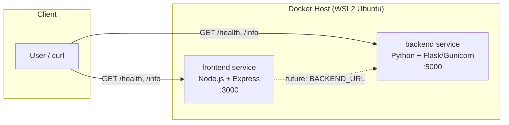

# Dummy Microservices Platform

A minimal two-service demo (`frontend` + `backend`) with `/health` and `/info`
endpoints, built as small non-root, multi-stage Docker images.

## Architecture

- **frontend** — Node.js 18 (Alpine) + Express
- **backend** — Python 3.12 (slim) + Flask/Gunicorn
- Both images run as a dedicated non-root user

## Build & Run

\`\`\`bash
docker build -t frontend-service:1.0.0 ./frontend
docker build -t backend-service:1.0.0 ./backend
docker run -d --name frontend -p 3000:3000 frontend-service:1.0.0
docker run -d --name backend  -p 5000:5000 backend-service:1.0.0
curl http://localhost:3000/health
curl http://localhost:5000/health
\`\`\`
