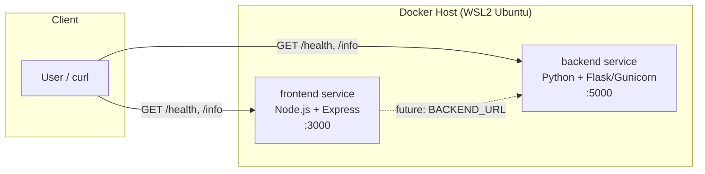

# Dummy Microservices Platform

A minimal two-service demo (`frontend` + `backend`) with `/health` and `/info`
endpoints, built as small non-root, multi-stage Docker images.

## Architecture



- **frontend** — Node.js 18 (Alpine) + Express
- **backend** — Python 3.12 (slim) + Flask/Gunicorn
- Both images run as a dedicated non-root user

## Build & Run

```bash
docker build -t frontend-service:1.0.0 ./frontend
docker build -t backend-service:1.0.0 ./backend
docker run -d --name frontend -p 3000:3000 frontend-service:1.0.0
docker run -d --name backend  -p 5000:5000 backend-service:1.0.0
curl http://localhost:3000/health
curl http://localhost:5000/health
```

---

## Week 2: Local Kubernetes Cluster via Terraform (kind)

### What was added
- `terraform/` — Terraform configuration provisioning a local Kubernetes cluster using the [`tehcyx/kind`](https://registry.terraform.io/providers/tehcyx/kind/latest) provider (kind = Kubernetes IN Docker).
- `scripts/cluster.sh` — convenience script to bring the cluster up, down, or recreate it.

### New Prerequisites
| Tool | Purpose | Check |
|---|---|---|
| kind | Run local Kubernetes nodes as Docker containers | `kind version` |
| Terraform provider `tehcyx/kind` | Manage kind clusters declaratively | installed automatically via `terraform init` |

Install kind:
```bash
curl -Lo ./kind https://kind.sigs.k8s.io/dl/v0.23.0/kind-linux-amd64
chmod +x ./kind && sudo mv ./kind /usr/local/bin/kind
```

### Terraform Variables (`terraform/variables.tf`)
| Variable | Description | Default |
|---|---|---|
| `cluster_name` | Name of the kind cluster | `microservices-cluster` |
| `kubernetes_version` | kind node image / Kubernetes version | `v1.29.2` |
| `worker_node_count` | Number of worker nodes | `1` |
| `kubeconfig_path` | Where the kubeconfig is written | `~/.kube/config-microservices-cluster` |
| `ingress_host_port` | Host port mapped to node port 80 | `8080` |

Override any variable at apply time, e.g.:
```bash
terraform -chdir=terraform apply -var="worker_node_count=2" -auto-approve
```

### Setup Instructions
```bash
cd terraform
terraform init
terraform plan
terraform apply -auto-approve

export KUBECONFIG=~/.kube/config-microservices-cluster
kubectl cluster-info
kubectl get nodes -o wide
```

### Cluster Lifecycle Script
```bash
./scripts/cluster.sh up         # provision (terraform apply)
./scripts/cluster.sh status     # show cluster + node status
./scripts/cluster.sh recreate   # destroy then re-apply, for testing
./scripts/cluster.sh down       # destroy (terraform destroy)
```

### Verification Checklist
- [x] `terraform apply` completes with no errors
- [x] `kubectl cluster-info` shows the control plane running
- [x] `kubectl get nodes` shows control-plane + worker node(s) as `Ready`
- [x] `kind-microservices-cluster` context available via `kubectl config get-contexts`
