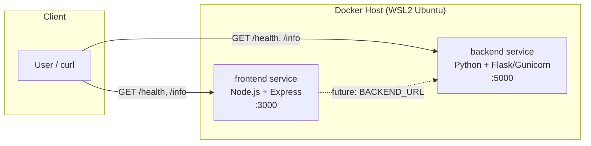
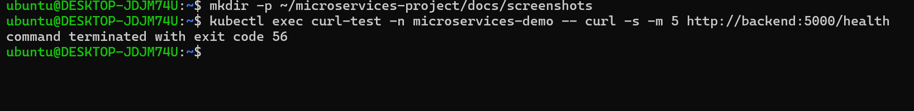
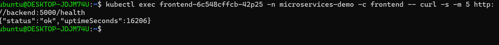
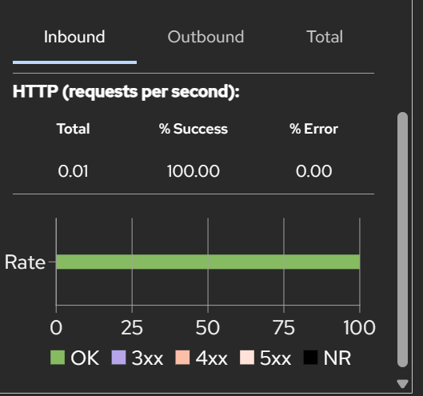
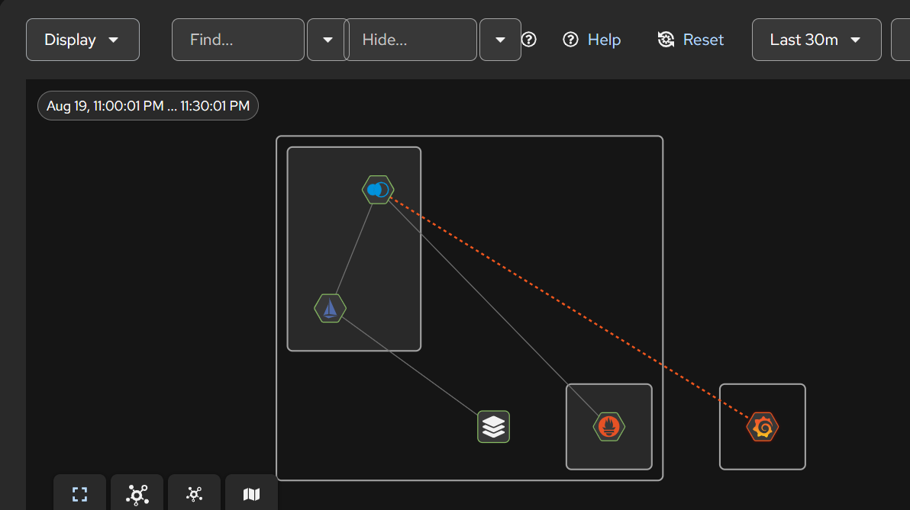

# Dummy Microservices Platform

A minimal two-service demo (`frontend` + `backend`) with `/health` and `/info`
endpoints, built as small non-root, multi-stage Docker images.

## Architecture



- **frontend** — Node.js 18 (Alpine) + Express
- **backend** — Python 3.12 (slim) + Flask/Gunicorn
- Both images run as a dedicated non-root user

## Build & Run

```bash
docker build -t frontend-service:1.0.0 ./frontend
docker build -t backend-service:1.0.0 ./backend
docker run -d --name frontend -p 3000:3000 frontend-service:1.0.0
docker run -d --name backend  -p 5000:5000 backend-service:1.0.0
curl http://localhost:3000/health
curl http://localhost:5000/health
```

---

## Week 2: Local Kubernetes Cluster via Terraform (kind)

### What was added
- `terraform/` — Terraform configuration provisioning a local Kubernetes cluster using the [`tehcyx/kind`](https://registry.terraform.io/providers/tehcyx/kind/latest) provider (kind = Kubernetes IN Docker).
- `scripts/cluster.sh` — convenience script to bring the cluster up, down, or recreate it.

### New Prerequisites
| Tool | Purpose | Check |
|---|---|---|
| kind | Run local Kubernetes nodes as Docker containers | `kind version` |
| Terraform provider `tehcyx/kind` | Manage kind clusters declaratively | installed automatically via `terraform init` |

Install kind:
```bash
curl -Lo ./kind https://kind.sigs.k8s.io/dl/v0.23.0/kind-linux-amd64
chmod +x ./kind && sudo mv ./kind /usr/local/bin/kind
```

### Terraform Variables (`terraform/variables.tf`)
| Variable | Description | Default |
|---|---|---|
| `cluster_name` | Name of the kind cluster | `microservices-cluster` |
| `kubernetes_version` | kind node image / Kubernetes version | `v1.29.2` |
| `worker_node_count` | Number of worker nodes | `1` |
| `kubeconfig_path` | Where the kubeconfig is written | `~/.kube/config-microservices-cluster` |
| `ingress_host_port` | Host port mapped to node port 80 | `8080` |

Override any variable at apply time, e.g.:
```bash
terraform -chdir=terraform apply -var="worker_node_count=2" -auto-approve
```

### Setup Instructions
```bash
cd terraform
terraform init
terraform plan
terraform apply -auto-approve

export KUBECONFIG=~/.kube/config-microservices-cluster
kubectl cluster-info
kubectl get nodes -o wide
```

### Cluster Lifecycle Script
```bash
./scripts/cluster.sh up         # provision (terraform apply)
./scripts/cluster.sh status     # show cluster + node status
./scripts/cluster.sh recreate   # destroy then re-apply, for testing
./scripts/cluster.sh down       # destroy (terraform destroy)
```

### Verification Checklist
- [x] `terraform apply` completes with no errors
- [x] `kubectl cluster-info` shows the control plane running
- [x] `kubectl get nodes` shows control-plane + worker node(s) as `Ready`
- [x] `kind-microservices-cluster` context available via `kubectl config get-contexts`

---

## Week 3: Kubernetes Manifests, Internal Service Communication, Probes & Resource Limits

### What was added
- `k8s/` — raw Kubernetes YAML manifests (no Helm yet) for both microservices:
  - `00-namespace.yaml` — dedicated `microservices-demo` namespace
  - `01-configmap.yaml` — shared non-sensitive config (app version, backend URL, etc.)
  - `02-secret.yaml` — dummy Opaque secret (API key, DB password placeholders)
  - `03/05-*-deployment.yaml` — Deployments for backend/frontend with resource requests/limits and liveness/readiness probes
  - `04/06-*-service.yaml` — ClusterIP Services enabling internal DNS-based discovery

### New Prerequisites
None beyond Week 1/2 (`kubectl`, a running kind cluster from Week 2).

### Setup Instructions
```bash
# Load locally built images into the kind cluster (kind can't see the Docker Desktop cache directly)
kind load docker-image frontend-service:1.0.0 --name microservices-cluster
kind load docker-image backend-service:1.0.0 --name microservices-cluster

# Apply manifests
kubectl apply -f k8s/

# Verify
kubectl get all -n microservices-demo
```

### Verifying Internal Communication
```bash
FRONTEND_POD=$(kubectl get pods -n microservices-demo -l app=frontend -o jsonpath='{.items[0].metadata.name}')
kubectl exec -n microservices-demo "$FRONTEND_POD" -- curl -s http://backend:5000/health
```
Services communicate over the cluster's internal DNS (`<service-name>.<namespace>.svc.cluster.local`, or just `<service-name>` within the same namespace) — no NodePort or external exposure needed for pod-to-pod traffic.

### Resource Limits & Requests
| Service | CPU Request | CPU Limit | Memory Request | Memory Limit |
|---|---|---|---|---|
| frontend | 50m | 200m | 64Mi | 128Mi |
| backend | 100m | 300m | 128Mi | 256Mi |

### Probes
Both services expose `/health` for readiness (checked every 10s, 5s initial delay) and liveness (checked every 20s, 15s initial delay), so Kubernetes only routes traffic to ready pods and restarts unresponsive ones automatically.

### Note: curl added to runtime images
The base Dockerfiles from Week 1 didn't include `curl`, so `kubectl exec ... -- curl` failed with
`executable file not found in $PATH`. Both Dockerfiles were updated to install `curl` in the final
runtime stage (`apk add --no-cache curl` for the Alpine-based frontend, `apt-get install curl` for
the Debian-slim backend), images were rebuilt, reloaded into kind with `kind load docker-image`,
and Deployments were force-refreshed with `kubectl rollout restart` since the image tag itself
didn't change.

### Verification Checklist
- [x] `kubectl apply -f k8s/` completes with no errors
- [x] Both Deployments show `2/2` ready replicas
- [x] `kubectl exec` + `curl` confirms frontend and backend reachability over internal DNS
- [x] `kubectl describe pod` shows configured resource requests/limits and probe results

---

## Week 4: Helm Chart

### What was added
- `helm/microservices/` — a Helm chart replacing the raw `k8s/` manifests from Week 3:
  - `Chart.yaml` — chart metadata
  - `values.yaml` — all environment-specific configuration (image tags, replica counts, resource limits, probe timings, config/secret values)
  - `templates/` — parameterized Deployment, Service, ConfigMap, and Secret templates for both services, plus `_helpers.tpl` for shared labels
- `scripts/helm-upgrade.sh` — lints the chart, then runs `helm upgrade --install`, waits for rollout, and prints release history

### New Prerequisites
| Tool | Purpose | Check |
|---|---|---|
| Helm 3 | Package and deploy the Kubernetes chart | `helm version` |

Install:
```bash
curl https://raw.githubusercontent.com/helm/helm/main/scripts/get-helm-3 | bash
```

### Chart Structure

helm/microservices/
├── Chart.yaml
├── values.yaml
└── templates/
├── _helpers.tpl
├── configmap.yaml
├── secret.yaml
├── backend-deployment.yaml
├── backend-service.yaml
├── frontend-deployment.yaml
└── frontend-service.yaml


### Key values.yaml Variables
| Variable | Description | Default |
|---|---|---|
| `frontend.image.tag` / `backend.image.tag` | Image version to deploy | `1.0.0` |
| `frontend.replicaCount` / `backend.replicaCount` | Pod replica count | `2` |
| `frontend.service.port` / `backend.service.port` | Service + container port | `3000` / `5000` |
| `frontend.resources` / `backend.resources` | CPU/memory requests & limits | see `values.yaml` |
| `frontend.probes` / `backend.probes` | Liveness/readiness probe timings | see `values.yaml` |
| `config.*` | Non-sensitive shared config (log level, backend host/port) | see `values.yaml` |
| `secrets.*` | Dummy secret values (API key, DB password placeholders) | see `values.yaml` |

Override any value at install/upgrade time, e.g.:
```bash
helm upgrade --install microservices-demo ./helm/microservices \
  --namespace microservices-demo --create-namespace \
  --set frontend.replicaCount=3 --set backend.image.tag=1.1.0
```

### Install
```bash
kubectl delete -f k8s/          # tear down Week 3's raw manifests first (same resource names)
helm lint ./helm/microservices
helm install microservices-demo ./helm/microservices --namespace microservices-demo --create-namespace
```

### Upgrade
```bash
./scripts/helm-upgrade.sh                       # uses microservices-demo namespace/release by default
./scripts/helm-upgrade.sh <namespace> <release>  # or override both
```
This runs `helm lint`, then `helm upgrade --install --wait`, then verifies rollout status and prints `helm history`.

### Upgrade Verified
`values.yaml` `replicaCount` was bumped and the upgrade script re-run; `helm history` showed a new
revision (1 → 2) with `STATUS: deployed`, and `kubectl get pods` confirmed the pod count matched
the new value, proving the upgrade path is live and working.

### Verification Checklist
- [x] `helm lint` passes with no errors
- [x] `helm install` succeeds and `helm list` shows the release as `deployed`
- [x] `kubectl exec` + `curl` confirms frontend and backend still reachable under Helm-managed resources
- [x] Changing a `values.yaml` field and running `./scripts/helm-upgrade.sh` produces a new `helm history` revision and the expected pod count


---

## Week 5: Istio Service Mesh with Strict mTLS

### Overview
Istio was installed on the local Kubernetes cluster using Helm to add a service mesh layer that handles traffic encryption, identity-based authentication, and network visibility between the `frontend` and `backend` microservices — with zero changes to application code.

### What Was Installed

| Component | Purpose | Installed via |
|---|---|---|
| Istio base | Core CRDs and cluster-wide resources | Helm (`istio/base`) |
| istiod | Istio control plane (manages config, mTLS certificates, sidecars) | Helm (`istio/istiod`) |
| Prometheus | Metrics backend used by Kiali | Helm (`prometheus-community/prometheus`) |
| Kiali | Visual service mesh dashboard | Helm (`kiali/kiali-server`) |

### Automatic Sidecar Injection

Automatic sidecar injection was enabled for the `microservices-demo` namespace, so every pod created in that namespace automatically gets an Istio proxy (`istio-proxy`) container attached alongside the application container:

```bash
kubectl label namespace microservices-demo istio-injection=enabled
```

Existing `backend` and `frontend` deployments were restarted so they'd pick up the sidecar:

```bash
kubectl rollout restart deployment backend -n microservices-demo
kubectl rollout restart deployment frontend -n microservices-demo
```

Confirmed by pods showing **`2/2`** containers (app + `istio-proxy`) instead of the previous `1/1`.

### Strict mTLS Configuration

A `PeerAuthentication` policy was applied to enforce **STRICT** mTLS mode across the namespace — meaning every connection must be mutually authenticated and encrypted, with no plain-text fallback allowed:

```yaml
# istio/peer-authentication.yaml
apiVersion: security.istio.io/v1
kind: PeerAuthentication
metadata:
  name: default
  namespace: microservices-demo
spec:
  mtls:
    mode: STRICT
```

Applied with:
```bash
kubectl apply -f istio/peer-authentication.yaml
```

### Before / After Networking Behavior

**Before Istio (Week 3):** any pod anywhere in the cluster could freely reach the backend service on port `5000` over plain, unauthenticated HTTP — there was no identity check and no encryption in transit.

**After Istio + Strict mTLS (Week 5):** only pods carrying a valid Istio sidecar (and therefore a valid mTLS certificate issued by `istiod`) can successfully connect to the backend. Any request from outside the mesh is rejected at the network layer before it ever reaches the application.

#### Test 1 — Un-injected pod (no sidecar) attempting to reach the backend

An "outsider" pod was deliberately created without a sidecar to simulate a non-mesh workload:

```bash
kubectl run curl-test --image=curlimages/curl -n microservices-demo \
  --labels="sidecar.istio.io/inject=false" \
  --command -- sleep 3600

kubectl exec curl-test -n microservices-demo -- curl -s -m 5 http://backend:5000/health
```

**Result:** connection blocked — `command terminated with exit code 56` (connection reset by peer). This confirms strict mTLS successfully rejects any traffic that isn't part of the mesh.



#### Test 2 — Frontend pod (with sidecar) reaching the backend

```bash
kubectl exec <frontend-pod> -n microservices-demo -c frontend -- curl -s -m 5 http://backend:5000/health
```

**Result:** succeeded — `{"status":"ok","uptimeSeconds":203}`. This confirms properly authenticated, mTLS-encrypted traffic flows normally between services that are part of the mesh.



### Kiali Mesh Topology

Traffic metrics between `frontend` and `backend` after generating test requests — showing 100% success rate and 0% errors:



Mesh graph showing padlock icons on both connections between `frontend` and `backend`, confirming mTLS encryption is actively securing that traffic:



### How to Reproduce

```bash
# 1. Install Istio
helm repo add istio https://istio-release.storage.googleapis.com/charts
helm repo update
kubectl create namespace istio-system
helm install istio-base istio/base -n istio-system --set defaultRevision=default
helm install istiod istio/istiod -n istio-system --wait

# 2. Enable automatic sidecar injection
kubectl label namespace microservices-demo istio-injection=enabled
kubectl rollout restart deployment backend -n microservices-demo
kubectl rollout restart deployment frontend -n microservices-demo

# 3. Apply strict mTLS
kubectl apply -f istio/peer-authentication.yaml

# 4. Install monitoring + Kiali
helm repo add prometheus-community https://prometheus-community.github.io/helm-charts
helm install prometheus prometheus-community/prometheus -n monitoring --set server.persistentVolume.enabled=false

helm repo add kiali https://kiali.org/helm-charts
helm install kiali-server kiali/kiali-server -n istio-system \
  --set auth.strategy="anonymous" \
  --set external_services.prometheus.url="http://prometheus-server.monitoring.svc.cluster.local"

# 5. View the dashboard
kubectl port-forward -n istio-system svc/kiali 20001:20001
# then open http://localhost:20001 in a browser
```

### Verification Checklist

- [x] Istio installed into the cluster via Helm (base + istiod)
- [x] Automatic sidecar injection enabled for `microservices-demo` namespace
- [x] Existing deployments restarted and confirmed running with sidecars (`2/2`)
- [x] Strict mTLS `PeerAuthentication` policy applied and verified
- [x] Un-injected pod confirmed blocked from reaching the backend
- [x] Injected frontend pod confirmed able to reach the backend
- [x] Kiali installed and mesh topology visualized with mTLS padlocks
