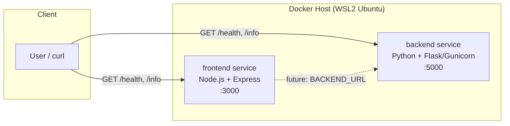
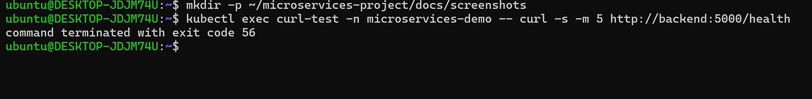
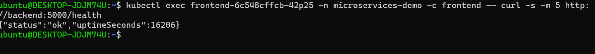
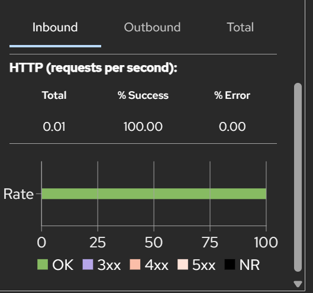
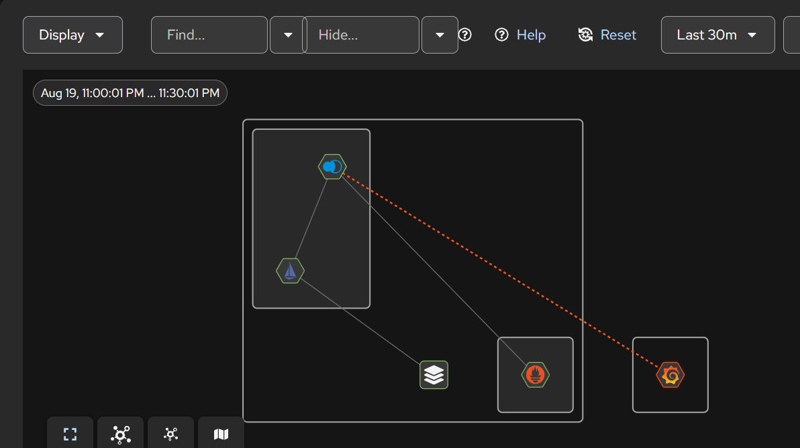

# Dummy Microservices Platform

A minimal two-service demo (`frontend` + `backend`) with `/health` and `/info`
endpoints, built as small non-root, multi-stage Docker images.

## Architecture


```mermaid
flowchart LR
    subgraph Client
        U[User / curl]
    end

    subgraph "Docker Host (WSL2 Ubuntu)"
        F["frontend service<br/>Node.js + Express<br/>:3000"]
        B["backend service<br/>Python + Flask/Gunicorn<br/>:5000"]
    end

    U -->|GET /health, /info| F
    U -->|GET /health, /info| B
    F -.->|future: BACKEND_URL| B
```

- **frontend** — Node.js 18 (Alpine) + Express
- **backend** — Python 3.12 (slim) + Flask/Gunicorn
- Both images run as a dedicated non-root user

## Build & Run

```bash
docker build -t frontend-service:1.0.0 ./frontend
docker build -t backend-service:1.0.0 ./backend
docker run -d --name frontend -p 3000:3000 frontend-service:1.0.0
docker run -d --name backend  -p 5000:5000 backend-service:1.0.0
curl http://localhost:3000/health
curl http://localhost:5000/health
```

---

## Week 2: Local Kubernetes Cluster via Terraform (kind)

### What was added
- `terraform/` — Terraform configuration provisioning a local Kubernetes cluster using the [`tehcyx/kind`](https://registry.terraform.io/providers/tehcyx/kind/latest) provider (kind = Kubernetes IN Docker).
- `scripts/cluster.sh` — convenience script to bring the cluster up, down, or recreate it.

### New Prerequisites
| Tool | Purpose | Check |
|---|---|---|
| kind | Run local Kubernetes nodes as Docker containers | `kind version` |
| Terraform provider `tehcyx/kind` | Manage kind clusters declaratively | installed automatically via `terraform init` |

Install kind:
```bash
curl -Lo ./kind https://kind.sigs.k8s.io/dl/v0.23.0/kind-linux-amd64
chmod +x ./kind && sudo mv ./kind /usr/local/bin/kind
```

### Terraform Variables (`terraform/variables.tf`)
| Variable | Description | Default |
|---|---|---|
| `cluster_name` | Name of the kind cluster | `microservices-cluster` |
| `kubernetes_version` | kind node image / Kubernetes version | `v1.29.2` |
| `worker_node_count` | Number of worker nodes | `1` |
| `kubeconfig_path` | Where the kubeconfig is written | `~/.kube/config-microservices-cluster` |
| `ingress_host_port` | Host port mapped to node port 80 | `8080` |

Override any variable at apply time, e.g.:
```bash
terraform -chdir=terraform apply -var="worker_node_count=2" -auto-approve
```

### Setup Instructions
```bash
cd terraform
terraform init
terraform plan
terraform apply -auto-approve

export KUBECONFIG=~/.kube/config-microservices-cluster
kubectl cluster-info
kubectl get nodes -o wide
```

### Cluster Lifecycle Script
```bash
./scripts/cluster.sh up         # provision (terraform apply)
./scripts/cluster.sh status     # show cluster + node status
./scripts/cluster.sh recreate   # destroy then re-apply, for testing
./scripts/cluster.sh down       # destroy (terraform destroy)
```

### Verification Checklist
- [x] `terraform apply` completes with no errors
- [x] `kubectl cluster-info` shows the control plane running
- [x] `kubectl get nodes` shows control-plane + worker node(s) as `Ready`
- [x] `kind-microservices-cluster` context available via `kubectl config get-contexts`

---

## Week 3: Kubernetes Manifests, Internal Service Communication, Probes & Resource Limits

### What was added
- `k8s/` — raw Kubernetes YAML manifests (no Helm yet) for both microservices:
  - `00-namespace.yaml` — dedicated `microservices-demo` namespace
  - `01-configmap.yaml` — shared non-sensitive config (app version, backend URL, etc.)
  - `02-secret.yaml` — dummy Opaque secret (API key, DB password placeholders)
  - `03/05-*-deployment.yaml` — Deployments for backend/frontend with resource requests/limits and liveness/readiness probes
  - `04/06-*-service.yaml` — ClusterIP Services enabling internal DNS-based discovery

### New Prerequisites
None beyond Week 1/2 (`kubectl`, a running kind cluster from Week 2).

### Setup Instructions
```bash
# Load locally built images into the kind cluster (kind can't see the Docker Desktop cache directly)
kind load docker-image frontend-service:1.0.0 --name microservices-cluster
kind load docker-image backend-service:1.0.0 --name microservices-cluster

# Apply manifests
kubectl apply -f k8s/

# Verify
kubectl get all -n microservices-demo
```

### Verifying Internal Communication
```bash
FRONTEND_POD=$(kubectl get pods -n microservices-demo -l app=frontend -o jsonpath='{.items[0].metadata.name}')
kubectl exec -n microservices-demo "$FRONTEND_POD" -- curl -s http://backend:5000/health
```
Services communicate over the cluster's internal DNS (`<service-name>.<namespace>.svc.cluster.local`, or just `<service-name>` within the same namespace) — no NodePort or external exposure needed for pod-to-pod traffic.

### Resource Limits & Requests
| Service | CPU Request | CPU Limit | Memory Request | Memory Limit |
|---|---|---|---|---|
| frontend | 50m | 200m | 64Mi | 128Mi |
| backend | 100m | 300m | 128Mi | 256Mi |

### Probes
Both services expose `/health` for readiness (checked every 10s, 5s initial delay) and liveness (checked every 20s, 15s initial delay), so Kubernetes only routes traffic to ready pods and restarts unresponsive ones automatically.

### Note: curl added to runtime images
The base Dockerfiles from Week 1 didn't include `curl`, so `kubectl exec ... -- curl` failed with
`executable file not found in $PATH`. Both Dockerfiles were updated to install `curl` in the final
runtime stage (`apk add --no-cache curl` for the Alpine-based frontend, `apt-get install curl` for
the Debian-slim backend), images were rebuilt, reloaded into kind with `kind load docker-image`,
and Deployments were force-refreshed with `kubectl rollout restart` since the image tag itself
didn't change.

### Verification Checklist
- [x] `kubectl apply -f k8s/` completes with no errors
- [x] Both Deployments show `2/2` ready replicas
- [x] `kubectl exec` + `curl` confirms frontend and backend reachability over internal DNS
- [x] `kubectl describe pod` shows configured resource requests/limits and probe results

---

## Week 4: Helm Chart

### What was added
- `helm/microservices/` — a Helm chart replacing the raw `k8s/` manifests from Week 3:
  - `Chart.yaml` — chart metadata
  - `values.yaml` — all environment-specific configuration (image tags, replica counts, resource limits, probe timings, config/secret values)
  - `templates/` — parameterized Deployment, Service, ConfigMap, and Secret templates for both services, plus `_helpers.tpl` for shared labels
- `scripts/helm-upgrade.sh` — lints the chart, then runs `helm upgrade --install`, waits for rollout, and prints release history

### New Prerequisites
| Tool | Purpose | Check |
|---|---|---|
| Helm 3 | Package and deploy the Kubernetes chart | `helm version` |

Install:
```bash
curl https://raw.githubusercontent.com/helm/helm/main/scripts/get-helm-3 | bash
```

### Chart Structure

helm/microservices/
├── Chart.yaml
├── values.yaml
└── templates/
├── _helpers.tpl
├── configmap.yaml
├── secret.yaml
├── backend-deployment.yaml
├── backend-service.yaml
├── frontend-deployment.yaml
└── frontend-service.yaml


### Key values.yaml Variables
| Variable | Description | Default |
|---|---|---|
| `frontend.image.tag` / `backend.image.tag` | Image version to deploy | `1.0.0` |
| `frontend.replicaCount` / `backend.replicaCount` | Pod replica count | `2` |
| `frontend.service.port` / `backend.service.port` | Service + container port | `3000` / `5000` |
| `frontend.resources` / `backend.resources` | CPU/memory requests & limits | see `values.yaml` |
| `frontend.probes` / `backend.probes` | Liveness/readiness probe timings | see `values.yaml` |
| `config.*` | Non-sensitive shared config (log level, backend host/port) | see `values.yaml` |
| `secrets.*` | Dummy secret values (API key, DB password placeholders) | see `values.yaml` |

Override any value at install/upgrade time, e.g.:
```bash
helm upgrade --install microservices-demo ./helm/microservices \
  --namespace microservices-demo --create-namespace \
  --set frontend.replicaCount=3 --set backend.image.tag=1.1.0
```

### Install
```bash
kubectl delete -f k8s/          # tear down Week 3's raw manifests first (same resource names)
helm lint ./helm/microservices
helm install microservices-demo ./helm/microservices --namespace microservices-demo --create-namespace
```

### Upgrade
```bash
./scripts/helm-upgrade.sh                       # uses microservices-demo namespace/release by default
./scripts/helm-upgrade.sh <namespace> <release>  # or override both
```
This runs `helm lint`, then `helm upgrade --install --wait`, then verifies rollout status and prints `helm history`.

### Upgrade Verified
`values.yaml` `replicaCount` was bumped and the upgrade script re-run; `helm history` showed a new
revision (1 → 2) with `STATUS: deployed`, and `kubectl get pods` confirmed the pod count matched
the new value, proving the upgrade path is live and working.

### Verification Checklist
- [x] `helm lint` passes with no errors
- [x] `helm install` succeeds and `helm list` shows the release as `deployed`
- [x] `kubectl exec` + `curl` confirms frontend and backend still reachable under Helm-managed resources
- [x] Changing a `values.yaml` field and running `./scripts/helm-upgrade.sh` produces a new `helm history` revision and the expected pod count


---

## Week 5: Istio Service Mesh with Strict mTLS

### Overview
Istio was installed on the local Kubernetes cluster using Helm to add a service mesh layer that handles traffic encryption, identity-based authentication, and network visibility between the `frontend` and `backend` microservices — with zero changes to application code.

### What Was Installed

| Component | Purpose | Installed via |
|---|---|---|
| Istio base | Core CRDs and cluster-wide resources | Helm (`istio/base`) |
| istiod | Istio control plane (manages config, mTLS certificates, sidecars) | Helm (`istio/istiod`) |
| Prometheus | Metrics backend used by Kiali | Helm (`prometheus-community/prometheus`) |
| Kiali | Visual service mesh dashboard | Helm (`kiali/kiali-server`) |

### Automatic Sidecar Injection

Automatic sidecar injection was enabled for the `microservices-demo` namespace, so every pod created in that namespace automatically gets an Istio proxy (`istio-proxy`) container attached alongside the application container:

```bash
kubectl label namespace microservices-demo istio-injection=enabled
```

Existing `backend` and `frontend` deployments were restarted so they'd pick up the sidecar:

```bash
kubectl rollout restart deployment backend -n microservices-demo
kubectl rollout restart deployment frontend -n microservices-demo
```

Confirmed by pods showing **`2/2`** containers (app + `istio-proxy`) instead of the previous `1/1`.

### Strict mTLS Configuration

A `PeerAuthentication` policy was applied to enforce **STRICT** mTLS mode across the namespace — meaning every connection must be mutually authenticated and encrypted, with no plain-text fallback allowed:

```yaml
# istio/peer-authentication.yaml
apiVersion: security.istio.io/v1
kind: PeerAuthentication
metadata:
  name: default
  namespace: microservices-demo
spec:
  mtls:
    mode: STRICT
```

Applied with:
```bash
kubectl apply -f istio/peer-authentication.yaml
```

### Before / After Networking Behavior

**Before Istio (Week 3):** any pod anywhere in the cluster could freely reach the backend service on port `5000` over plain, unauthenticated HTTP — there was no identity check and no encryption in transit.

**After Istio + Strict mTLS (Week 5):** only pods carrying a valid Istio sidecar (and therefore a valid mTLS certificate issued by `istiod`) can successfully connect to the backend. Any request from outside the mesh is rejected at the network layer before it ever reaches the application.

#### Test 1 — Un-injected pod (no sidecar) attempting to reach the backend

An "outsider" pod was deliberately created without a sidecar to simulate a non-mesh workload:

```bash
kubectl run curl-test --image=curlimages/curl -n microservices-demo \
  --labels="sidecar.istio.io/inject=false" \
  --command -- sleep 3600

kubectl exec curl-test -n microservices-demo -- curl -s -m 5 http://backend:5000/health
```

**Result:** connection blocked — `command terminated with exit code 56` (connection reset by peer). This confirms strict mTLS successfully rejects any traffic that isn't part of the mesh.



#### Test 2 — Frontend pod (with sidecar) reaching the backend

```bash
kubectl exec <frontend-pod> -n microservices-demo -c frontend -- curl -s -m 5 http://backend:5000/health
```

**Result:** succeeded — `{"status":"ok","uptimeSeconds":203}`. This confirms properly authenticated, mTLS-encrypted traffic flows normally between services that are part of the mesh.



### Kiali Mesh Topology

Traffic metrics between `frontend` and `backend` after generating test requests — showing 100% success rate and 0% errors:



Mesh graph showing padlock icons on both connections between `frontend` and `backend`, confirming mTLS encryption is actively securing that traffic:



### How to Reproduce

```bash
# 1. Install Istio
helm repo add istio https://istio-release.storage.googleapis.com/charts
helm repo update
kubectl create namespace istio-system
helm install istio-base istio/base -n istio-system --set defaultRevision=default
helm install istiod istio/istiod -n istio-system --wait

# 2. Enable automatic sidecar injection
kubectl label namespace microservices-demo istio-injection=enabled
kubectl rollout restart deployment backend -n microservices-demo
kubectl rollout restart deployment frontend -n microservices-demo

# 3. Apply strict mTLS
kubectl apply -f istio/peer-authentication.yaml

# 4. Install monitoring + Kiali
helm repo add prometheus-community https://prometheus-community.github.io/helm-charts
helm install prometheus prometheus-community/prometheus -n monitoring --set server.persistentVolume.enabled=false

helm repo add kiali https://kiali.org/helm-charts
helm install kiali-server kiali/kiali-server -n istio-system \
  --set auth.strategy="anonymous" \
  --set external_services.prometheus.url="http://prometheus-server.monitoring.svc.cluster.local"

# 5. View the dashboard
kubectl port-forward -n istio-system svc/kiali 20001:20001
# then open http://localhost:20001 in a browser
```

### Verification Checklist

- [x] Istio installed into the cluster via Helm (base + istiod)
- [x] Automatic sidecar injection enabled for `microservices-demo` namespace
- [x] Existing deployments restarted and confirmed running with sidecars (`2/2`)
- [x] Strict mTLS `PeerAuthentication` policy applied and verified
- [x] Un-injected pod confirmed blocked from reaching the backend
- [x] Injected frontend pod confirmed able to reach the backend
- [x] Kiali installed and mesh topology visualized with mTLS padlocks


---

## Week 6: Kong API Gateway — Ingress, Rate Limiting & API Key Auth

### Overview
Kong was installed as the single ingress point into the cluster using Helm, replacing direct NodePort access to the `frontend` service. Kong now handles external routing, rate limiting, and API key authentication before any request reaches the microservices — all while staying compatible with the strict mTLS mesh established in Week 5.

### What Was Installed

| Component | Purpose | Installed via |
|---|---|---|
| Kong Gateway | Single ingress point / API gateway | Helm (`kong/kong`) |
| Kong Ingress Controller | Watches Kubernetes Ingress + KongPlugin resources and syncs them to Kong | Bundled with the Kong Helm chart |

Installed into a dedicated `kong` namespace:
```bash
helm repo add kong https://charts.konghq.com
helm repo update
kubectl create namespace kong
helm install kong kong/kong -n kong \
  --set ingressController.installCRDs=false \
  --set admin.enabled=true \
  --set admin.type=ClusterIP \
  --set proxy.type=NodePort
```

### Routing: Exposing the Frontend

A Kubernetes `Ingress` resource routes all traffic through Kong to the `frontend` service:

```yaml
# kong/frontend-ingress.yaml
apiVersion: networking.k8s.io/v1
kind: Ingress
metadata:
  name: frontend-ingress
  namespace: microservices-demo
  annotations:
    konghq.com/strip-path: "true"
    konghq.com/plugins: frontend-rate-limit,frontend-key-auth
spec:
  ingressClassName: kong
  rules:
    - http:
        paths:
          - path: /
            pathType: Prefix
            backend:
              service:
                name: frontend
                port:
                  number: 3000
```

### mTLS Compatibility Note

Kong's pod does not run an Istio sidecar (API gateways typically sit at the mesh edge rather than inside it). Since the Week 5 `PeerAuthentication` policy enforces STRICT mTLS across the `microservices-demo` namespace, a sidecar-less Kong could not reach `frontend` directly. This was resolved with a **port-level PERMISSIVE override** scoped only to the frontend's ingress port, so Kong can reach it over plain HTTP while `frontend ↔ backend` traffic inside the mesh remains fully mTLS-encrypted:

```yaml
# istio/frontend-permissive.yaml
apiVersion: security.istio.io/v1
kind: PeerAuthentication
metadata:
  name: frontend-permissive
  namespace: microservices-demo
spec:
  selector:
    matchLabels:
      app: frontend
  mtls:
    mode: PERMISSIVE
  portLevelMtls:
    3000:
      mode: PERMISSIVE
```

### Rate Limiting

A `KongPlugin` of type `rate-limiting` was applied, capping traffic at **5 requests per minute** per client:

```yaml
# kong/rate-limit-plugin.yaml
apiVersion: configuration.konghq.com/v1
kind: KongPlugin
metadata:
  name: frontend-rate-limit
  namespace: microservices-demo
plugin: rate-limiting
config:
  minute: 5
  policy: local
```

#### Test Script

`kong/test-rate-limit.sh` sends 10 rapid requests to the Kong-proxied endpoint and checks the HTTP status of each:

```bash
#!/bin/bash
URL="http://localhost:8000/health"
TOTAL_REQUESTS=10

for i in $(seq 1 $TOTAL_REQUESTS); do
  STATUS=$(curl -s -o /dev/null -w "%{http_code}" "$URL")
  echo "Request $i: HTTP $STATUS"
  sleep 0.5
done
```

**Result:**
```
Request 1:  SUCCESS       (HTTP 200)
Request 2:  SUCCESS       (HTTP 200)
Request 3:  SUCCESS       (HTTP 200)
Request 4:  SUCCESS       (HTTP 200)
Request 5:  SUCCESS       (HTTP 200)
Request 6:  RATE LIMITED  (HTTP 429)
Request 7:  RATE LIMITED  (HTTP 429)
Request 8:  RATE LIMITED  (HTTP 429)
Request 9:  RATE LIMITED  (HTTP 429)
Request 10: RATE LIMITED  (HTTP 429)
```

The first 5 requests within the minute succeeded; every request after that was correctly rejected with `429 Too Many Requests`, confirming the rate limit is enforced.

### API Key Authentication

A `key-auth` plugin was applied to require a valid API key on the same route:

```yaml
# kong/key-auth-plugin.yaml
apiVersion: configuration.konghq.com/v1
kind: KongPlugin
metadata:
  name: frontend-key-auth
  namespace: microservices-demo
plugin: key-auth
config:
  key_names:
    - apikey
```

A `KongConsumer` and a labeled `Secret` provide a demo API key:

```yaml
# kong/kong-consumer.yaml
apiVersion: configuration.konghq.com/v1
kind: KongConsumer
metadata:
  name: demo-consumer
  namespace: microservices-demo
  annotations:
    kubernetes.io/ingress.class: kong
username: demo-consumer
credentials:
  - demo-consumer-apikey-secret
```

```yaml
# kong/consumer-secret.yaml
apiVersion: v1
kind: Secret
metadata:
  name: demo-consumer-apikey-secret
  namespace: microservices-demo
  labels:
    konghq.com/credential: key-auth
type: Opaque
stringData:
  kongCredType: key-auth
  key: my-secret-api-key-12345
```

#### Test Results

**Without an API key:**
```bash
curl -s -o /dev/null -w "%{http_code}\n" http://localhost:8000/health
```
```
401
```

**With a valid API key:**
```bash
curl -s -o /dev/null -w "%{http_code}\n" -H "apikey: my-secret-api-key-12345" http://localhost:8000/health
```
```
200
```

This confirms the route correctly rejects unauthenticated requests and accepts requests carrying a valid key.

### How to Reproduce

```bash
# 1. Install Kong
helm repo add kong https://charts.konghq.com
helm repo update
kubectl create namespace kong
helm install kong kong/kong -n kong \
  --set ingressController.installCRDs=false \
  --set admin.enabled=true \
  --set admin.type=ClusterIP \
  --set proxy.type=NodePort

# 2. Allow Kong (no sidecar) to reach frontend under strict mesh mTLS
kubectl apply -f istio/frontend-permissive.yaml

# 3. Apply routing + plugins
kubectl apply -f kong/rate-limit-plugin.yaml
kubectl apply -f kong/key-auth-plugin.yaml
kubectl apply -f kong/consumer-secret.yaml
kubectl apply -f kong/kong-consumer.yaml
kubectl apply -f kong/frontend-ingress.yaml

# 4. Access Kong locally
kubectl port-forward -n kong svc/kong-kong-proxy 8000:80

# 5. Run the rate-limit test
cd kong
chmod +x test-rate-limit.sh
./test-rate-limit.sh

# 6. Test API key auth
curl -s -o /dev/null -w "%{http_code}\n" http://localhost:8000/health                                  # expect 401
curl -s -o /dev/null -w "%{http_code}\n" -H "apikey: my-secret-api-key-12345" http://localhost:8000/health  # expect 200
```

### Verification Checklist

- [x] Kong installed as the single ingress point via Helm
- [x] Routing rule exposes `frontend` through Kong
- [x] Rate-limiting plugin enforces 5 requests/minute
- [x] Test script confirms `429` after the limit is hit
- [x] API key authentication enforced on the route
- [x] Verified `401` without a key and `200` with a valid key
- [x] Confirmed continued mTLS encryption between `frontend` and `backend` inside the mesh


Task 7: CI/CD Pipeline with GitHub Actions

This task sets up a complete CI/CD pipeline for the microservices repository using GitHub Actions, covering automated testing, Docker image builds, and pushing versioned images to GitHub Container Registry (GHCR).

Objectives
Run linting and unit tests automatically on every push
Build Docker images for each microservice (backend, frontend)
Push images to a container registry on main branch merges
Tag images using the Git commit SHA for traceability
Verify the pipeline runs successfully and images appear in the registry
Pipeline Overview

The workflow is defined in .github/workflows/ci.yml and triggers on: push. It consists of the following jobs:

backend-test — installs dependencies and runs lint + unit tests for the backend service
frontend-test — installs dependencies and runs lint + unit tests for the frontend service
build-and-push — runs only after both test jobs pass; builds Docker images and pushes them to GHCR
Steps Followed
Created the workflow file Added .github/workflows/ci.yml inside the repo, triggered on every push event.
Configured linting and unit tests
Added a backend-test job that installs backend dependencies (requirements.txt / package.json depending on the service) and runs the test/lint commands.
Added a frontend-test job doing the same for the frontend service.
Both jobs run in parallel and must pass before the build step starts.
Set up Docker Buildx and GHCR authentication
Used docker/setup-buildx-action to enable multi-stage/cache-friendly builds.
Logged in to GHCR using docker/login-action with github.actor and the built-in GITHUB_TOKEN (granted packages: write permission in the workflow file).
Configured build-and-push job
Used docker/build-push-action@v6 to build each service's Dockerfile (./backend, ./frontend).
Set push: true so images are pushed only after a successful build.
Restricted this job to run only on pushes to main (using an if: github.ref == 'refs/heads/main' condition or a branches: [main] trigger), so it doesn't fire on feature branches.
Implemented image tagging strategy
Every image is tagged with two tags:
latest — always points to the most recent build on main
${{ github.sha }} (short commit SHA, e.g. 20f39fc) — gives a unique, traceable tag per commit
Example tag configuration:
yaml
     tags: |
       ghcr.io/<owner>/<repo>/backend:latest
       ghcr.io/<owner>/<repo>/backend:${{ github.sha }}
Verified the pipeline
Pushed a commit to main and confirmed the Actions run showed Success (backend-test, frontend-test, build-and-push all green).
Confirmed total run duration and that 2 artifacts/images were produced.
Opened the repository's Packages tab on GitHub and confirmed both backend and frontend images were listed, each with the latest tag and the corresponding commit SHA tag (e.g. 20f39fc).
Registry Used

GitHub Container Registry (GHCR) — chosen because it integrates natively with GitHub Actions via the built-in GITHUB_TOKEN, avoiding the need for extra secrets.

Result
Workflow run: Success, total duration ~1m 8s
Images pushed:
ghcr.io/<owner>/<repo>/backend:latest and ghcr.io/<owner>/<repo>/backend:<commit-sha>
ghcr.io/<owner>/<repo>/frontend:latest and ghcr.io/<owner>/<repo>/frontend:<commit-sha>
Both packages confirmed visible under the GitHub Packages section
