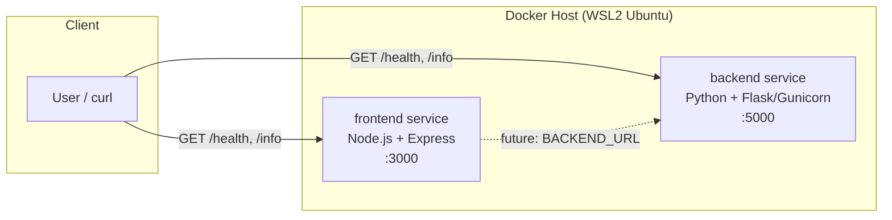

# Dummy Microservices Platform

A minimal two-service demo (`frontend` + `backend`) with `/health` and `/info`
endpoints, built as small non-root, multi-stage Docker images.

## Architecture


```mermaid
flowchart LR
    subgraph Client
        U[User / curl]
    end

    subgraph "Docker Host (WSL2 Ubuntu)"
        F["frontend service<br/>Node.js + Express<br/>:3000"]
        B["backend service<br/>Python + Flask/Gunicorn<br/>:5000"]
    end

    U -->|GET /health, /info| F
    U -->|GET /health, /info| B
    F -.->|future: BACKEND_URL| B
```

- **frontend** — Node.js 18 (Alpine) + Express
- **backend** — Python 3.12 (slim) + Flask/Gunicorn
- Both images run as a dedicated non-root user

## Build & Run

```bash
docker build -t frontend-service:1.0.0 ./frontend
docker build -t backend-service:1.0.0 ./backend
docker run -d --name frontend -p 3000:3000 frontend-service:1.0.0
docker run -d --name backend  -p 5000:5000 backend-service:1.0.0
curl http://localhost:3000/health
curl http://localhost:5000/health
```

---

## Week 2: Local Kubernetes Cluster via Terraform (kind)

### What was added
- `terraform/` — Terraform configuration provisioning a local Kubernetes cluster using the [`tehcyx/kind`](https://registry.terraform.io/providers/tehcyx/kind/latest) provider (kind = Kubernetes IN Docker).
- `scripts/cluster.sh` — convenience script to bring the cluster up, down, or recreate it.

### New Prerequisites
| Tool | Purpose | Check |
|---|---|---|
| kind | Run local Kubernetes nodes as Docker containers | `kind version` |
| Terraform provider `tehcyx/kind` | Manage kind clusters declaratively | installed automatically via `terraform init` |

Install kind:
```bash
curl -Lo ./kind https://kind.sigs.k8s.io/dl/v0.23.0/kind-linux-amd64
chmod +x ./kind && sudo mv ./kind /usr/local/bin/kind
```

### Terraform Variables (`terraform/variables.tf`)
| Variable | Description | Default |
|---|---|---|
| `cluster_name` | Name of the kind cluster | `microservices-cluster` |
| `kubernetes_version` | kind node image / Kubernetes version | `v1.29.2` |
| `worker_node_count` | Number of worker nodes | `1` |
| `kubeconfig_path` | Where the kubeconfig is written | `~/.kube/config-microservices-cluster` |
| `ingress_host_port` | Host port mapped to node port 80 | `8080` |

Override any variable at apply time, e.g.:
```bash
terraform -chdir=terraform apply -var="worker_node_count=2" -auto-approve
```

### Setup Instructions
```bash
cd terraform
terraform init
terraform plan
terraform apply -auto-approve

export KUBECONFIG=~/.kube/config-microservices-cluster
kubectl cluster-info
kubectl get nodes -o wide
```

### Cluster Lifecycle Script
```bash
./scripts/cluster.sh up         # provision (terraform apply)
./scripts/cluster.sh status     # show cluster + node status
./scripts/cluster.sh recreate   # destroy then re-apply, for testing
./scripts/cluster.sh down       # destroy (terraform destroy)
```

### Verification Checklist
- [x] `terraform apply` completes with no errors
- [x] `kubectl cluster-info` shows the control plane running
- [x] `kubectl get nodes` shows control-plane + worker node(s) as `Ready`
- [x] `kind-microservices-cluster` context available via `kubectl config get-contexts`

---

## Week 3: Kubernetes Manifests, Internal Service Communication, Probes & Resource Limits

### What was added
- `k8s/` — raw Kubernetes YAML manifests (no Helm yet) for both microservices:
  - `00-namespace.yaml` — dedicated `microservices-demo` namespace
  - `01-configmap.yaml` — shared non-sensitive config (app version, backend URL, etc.)
  - `02-secret.yaml` — dummy Opaque secret (API key, DB password placeholders)
  - `03/05-*-deployment.yaml` — Deployments for backend/frontend with resource requests/limits and liveness/readiness probes
  - `04/06-*-service.yaml` — ClusterIP Services enabling internal DNS-based discovery

### New Prerequisites
None beyond Week 1/2 (`kubectl`, a running kind cluster from Week 2).

### Setup Instructions
```bash
# Load locally built images into the kind cluster (kind can't see the Docker Desktop cache directly)
kind load docker-image frontend-service:1.0.0 --name microservices-cluster
kind load docker-image backend-service:1.0.0 --name microservices-cluster

# Apply manifests
kubectl apply -f k8s/

# Verify
kubectl get all -n microservices-demo
```

### Verifying Internal Communication
```bash
FRONTEND_POD=$(kubectl get pods -n microservices-demo -l app=frontend -o jsonpath='{.items[0].metadata.name}')
kubectl exec -n microservices-demo "$FRONTEND_POD" -- curl -s http://backend:5000/health
```
Services communicate over the cluster's internal DNS (`<service-name>.<namespace>.svc.cluster.local`, or just `<service-name>` within the same namespace) — no NodePort or external exposure needed for pod-to-pod traffic.

### Resource Limits & Requests
| Service | CPU Request | CPU Limit | Memory Request | Memory Limit |
|---|---|---|---|---|
| frontend | 50m | 200m | 64Mi | 128Mi |
| backend | 100m | 300m | 128Mi | 256Mi |

### Probes
Both services expose `/health` for readiness (checked every 10s, 5s initial delay) and liveness (checked every 20s, 15s initial delay), so Kubernetes only routes traffic to ready pods and restarts unresponsive ones automatically.

### Note: curl added to runtime images
The base Dockerfiles from Week 1 didn't include `curl`, so `kubectl exec ... -- curl` failed with
`executable file not found in $PATH`. Both Dockerfiles were updated to install `curl` in the final
runtime stage (`apk add --no-cache curl` for the Alpine-based frontend, `apt-get install curl` for
the Debian-slim backend), images were rebuilt, reloaded into kind with `kind load docker-image`,
and Deployments were force-refreshed with `kubectl rollout restart` since the image tag itself
didn't change.

### Verification Checklist
- [x] `kubectl apply -f k8s/` completes with no errors
- [x] Both Deployments show `2/2` ready replicas
- [x] `kubectl exec` + `curl` confirms frontend and backend reachability over internal DNS
- [x] `kubectl describe pod` shows configured resource requests/limits and probe results

---

## Week 4: Helm Chart

### What was added
- `helm/microservices/` — a Helm chart replacing the raw `k8s/` manifests from Week 3:
  - `Chart.yaml` — chart metadata
  - `values.yaml` — all environment-specific configuration (image tags, replica counts, resource limits, probe timings, config/secret values)
  - `templates/` — parameterized Deployment, Service, ConfigMap, and Secret templates for both services, plus `_helpers.tpl` for shared labels
- `scripts/helm-upgrade.sh` — lints the chart, then runs `helm upgrade --install`, waits for rollout, and prints release history

### New Prerequisites
| Tool | Purpose | Check |
|---|---|---|
| Helm 3 | Package and deploy the Kubernetes chart | `helm version` |

Install:
```bash
curl https://raw.githubusercontent.com/helm/helm/main/scripts/get-helm-3 | bash
```

### Chart Structure

helm/microservices/
├── Chart.yaml
├── values.yaml
└── templates/
├── _helpers.tpl
├── configmap.yaml
├── secret.yaml
├── backend-deployment.yaml
├── backend-service.yaml
├── frontend-deployment.yaml
└── frontend-service.yaml


### Key values.yaml Variables
| Variable | Description | Default |
|---|---|---|
| `frontend.image.tag` / `backend.image.tag` | Image version to deploy | `1.0.0` |
| `frontend.replicaCount` / `backend.replicaCount` | Pod replica count | `2` |
| `frontend.service.port` / `backend.service.port` | Service + container port | `3000` / `5000` |
| `frontend.resources` / `backend.resources` | CPU/memory requests & limits | see `values.yaml` |
| `frontend.probes` / `backend.probes` | Liveness/readiness probe timings | see `values.yaml` |
| `config.*` | Non-sensitive shared config (log level, backend host/port) | see `values.yaml` |
| `secrets.*` | Dummy secret values (API key, DB password placeholders) | see `values.yaml` |

Override any value at install/upgrade time, e.g.:
```bash
helm upgrade --install microservices-demo ./helm/microservices \
  --namespace microservices-demo --create-namespace \
  --set frontend.replicaCount=3 --set backend.image.tag=1.1.0
```

### Install
```bash
kubectl delete -f k8s/          # tear down Week 3's raw manifests first (same resource names)
helm lint ./helm/microservices
helm install microservices-demo ./helm/microservices --namespace microservices-demo --create-namespace
```

### Upgrade
```bash
./scripts/helm-upgrade.sh                       # uses microservices-demo namespace/release by default
./scripts/helm-upgrade.sh <namespace> <release>  # or override both
```
This runs `helm lint`, then `helm upgrade --install --wait`, then verifies rollout status and prints `helm history`.

### Upgrade Verified
`values.yaml` `replicaCount` was bumped and the upgrade script re-run; `helm history` showed a new
revision (1 → 2) with `STATUS: deployed`, and `kubectl get pods` confirmed the pod count matched
the new value, proving the upgrade path is live and working.

### Verification Checklist
- [x] `helm lint` passes with no errors
- [x] `helm install` succeeds and `helm list` shows the release as `deployed`
- [x] `kubectl exec` + `curl` confirms frontend and backend still reachable under Helm-managed resources
- [x] Changing a `values.yaml` field and running `./scripts/helm-upgrade.sh` produces a new `helm history` revision and the expected pod count


---

## Week 10: Alertmanager — Alert Rules, Notifications & Incident Response

### Overview
Alertmanager was configured to work alongside Prometheus (installed via the `kube-prometheus-stack` Helm chart) to detect abnormal conditions in the cluster and send notifications to an external channel. Three alert rules covering different severity levels were created, a mock notification channel was wired up, an alert was deliberately triggered end-to-end, and a runbook was written documenting the response procedure for each alert.

### What Was Installed

| Component | Purpose | Installed via |
|---|---|---|
| Prometheus | Metrics collection and alert rule evaluation | Helm (`prometheus-community/kube-prometheus-stack`) |
| Alertmanager | Routes firing alerts to notification channels | Bundled with the same Helm chart |
| Grafana | Dashboarding (bundled, not the focus of this week) | Bundled with the same Helm chart |

```bash
helm repo update
kubectl create namespace monitoring
helm install monitoring prometheus-community/kube-prometheus-stack \
  -n monitoring \
  --set prometheus.prometheusSpec.serviceMonitorSelectorNilUsesHelmValues=false \
  --set grafana.enabled=true
```

### Notification Channel

A [webhook.site](https://webhook.site) endpoint was used as a mock Slack/webhook receiver — it accepts the same HTTP POST payload Alertmanager would send to a real Slack incoming webhook, without needing a live Slack workspace for this exercise.

Alertmanager's config was overridden via its Kubernetes Secret:

```yaml
# monitoring/alertmanager-config.yaml
apiVersion: v1
kind: Secret
metadata:
  name: alertmanager-monitoring-kube-prometheus-alertmanager
  namespace: monitoring
type: Opaque
stringData:
  alertmanager.yaml: |
    global:
      resolve_timeout: 5m
    route:
      receiver: 'slack-mock'
      group_by: ['alertname', 'severity']
      group_wait: 10s
      group_interval: 30s
      repeat_interval: 1h
    receivers:
      - name: 'slack-mock'
        webhook_configs:
          - url: 'https://webhook.site/6bf1d0a0-5584-45fd-acb4-e7199e73d703'
            send_resolved: true
```

Applied with:
```bash
kubectl apply -f monitoring/alertmanager-config.yaml
kubectl delete pod -n monitoring -l app.kubernetes.io/name=alertmanager
```

### Alert Rules

Three alert rules were defined in a `PrometheusRule` resource, covering three severity levels:

| Alert | Severity | Condition |
|---|---|---|
| `PodCrashLooping` | critical | A pod restarts more than 3 times in 10 minutes |
| `HighErrorRate` | high | More than 5% of HTTP requests return 5xx over 5 minutes |
| `HighLatency` | warning | 95th percentile request latency exceeds 1 second over 5 minutes |

```yaml
# monitoring/alert-rules.yaml
apiVersion: monitoring.coreos.com/v1
kind: PrometheusRule
metadata:
  name: microservices-alert-rules
  namespace: monitoring
  labels:
    release: monitoring
spec:
  groups:
    - name: microservices.rules
      rules:
        - alert: PodCrashLooping
          expr: increase(kube_pod_container_status_restarts_total{namespace="microservices-demo"}[10m]) > 3
          for: 2m
          labels:
            severity: critical
          annotations:
            summary: "Pod {{ $labels.pod }} is crash looping"
            description: "Pod {{ $labels.pod }} in namespace {{ $labels.namespace }} has restarted more than 3 times in the last 10 minutes."

        - alert: HighErrorRate
          expr: |
            sum(rate(http_requests_total{status=~"5.."}[5m])) by (namespace)
            /
            sum(rate(http_requests_total[5m])) by (namespace) > 0.05
          for: 5m
          labels:
            severity: high
          annotations:
            summary: "High error rate detected in {{ $labels.namespace }}"
            description: "More than 5% of requests are returning 5xx errors in the last 5 minutes."

        - alert: HighLatency
          expr: |
            histogram_quantile(0.95, sum(rate(http_request_duration_seconds_bucket[5m])) by (le, namespace)) > 1
          for: 5m
          labels:
            severity: warning
          annotations:
            summary: "High request latency in {{ $labels.namespace }}"
            description: "95th percentile request latency is above 1 second for the last 5 minutes."
```

Applied with:
```bash
kubectl apply -f monitoring/alert-rules.yaml
```

> **Note:** `HighErrorRate` and `HighLatency` depend on `http_requests_total` / `http_request_duration_seconds_bucket` metrics, which would require instrumenting the demo Flask/Express apps with a Prometheus client library. They are correctly registered and visible in Prometheus but remain inactive in this environment since the services don't yet expose those metrics. `PodCrashLooping` uses cluster-level metrics (`kube_state_metrics`) that are available out of the box, so it was used for the live trigger test below.

### Runbook

A full runbook (`monitoring/RUNBOOK.md`) documents, for each alert: what it means, why it fires, and the exact response steps an on-call engineer should follow (checking logs, checking rollout history, rolling back, scaling, etc.). See that file for the complete procedures.

### Live Alert Trigger Test

To validate the pipeline end-to-end, a backend pod was deliberately forced into a crash loop:

```bash
kubectl exec backend-8c5fb57b9-wgpdc -n microservices-demo -c backend -- python3 -c "
x = []
while True:
    x.append(' ' * 10**6)
"
```

This repeatedly exhausted the container's memory limit, causing it to be `OOMKilled` and restarted by Kubernetes. Repeating this a few times pushed the pod into `CrashLoopBackOff` with more than 3 restarts within 10 minutes.

**Result:**

| Stage | Observation |
|---|---|
| Pod status | `backend-8c5fb57b9-wgpdc` reached `CrashLoopBackOff`, restart count > 3 |
| Prometheus | `PodCrashLooping` alert moved from `Inactive` → `Pending` → `Firing` |
| Time to fire | ~2 minutes from condition becoming true (matches the `for: 2m` setting) |
| Notification | Alertmanager sent a `firing` POST request to the webhook, followed later by a `resolved` POST once the pod stabilized |

Example payload received (trimmed):
```json
{
  "receiver": "slack-mock",
  "status": "resolved",
  "alerts": [ ... ]
}
```

This confirms the full loop works: **metric breach → alert evaluation → firing → notification delivery → auto-resolve notification**, all without any manual intervention beyond the deliberate fault injection.

### How to Reproduce

```bash
# 1. Install Prometheus + Alertmanager
helm repo add prometheus-community https://prometheus-community.github.io/helm-charts
helm repo update
kubectl create namespace monitoring
helm install monitoring prometheus-community/kube-prometheus-stack -n monitoring \
  --set prometheus.prometheusSpec.serviceMonitorSelectorNilUsesHelmValues=false

# 2. Configure the notification channel
kubectl apply -f monitoring/alertmanager-config.yaml
kubectl delete pod -n monitoring -l app.kubernetes.io/name=alertmanager

# 3. Apply the alert rules
kubectl apply -f monitoring/alert-rules.yaml

# 4. View Prometheus alerts
kubectl port-forward -n monitoring svc/monitoring-kube-prometheus-prometheus 9090:9090
# open http://localhost:9090/alerts

# 5. Trigger a test alert
kubectl exec <backend-pod> -n microservices-demo -c backend -- python3 -c "
x = []
while True:
    x.append(' ' * 10**6)
"
# repeat a few times until restarts > 3 within 10 minutes
```

### Verification Checklist

- [x] Alertmanager configured and connected to Prometheus
- [x] 3 alert rules created across 3 severity levels (critical, high, warning)
- [x] Notification channel (mock webhook) configured and verified
- [x] Runbook written covering meaning and response steps for each alert
- [x] Alert deliberately triggered (pod OOMKilled repeatedly → CrashLoopBackOff)
- [x] Confirmed alert transitioned Inactive → Pending → Firing in Prometheus
- [x] Confirmed both "firing" and "resolved" notifications were delivered to the webhook
---


     
